# embodied-agent

<p align="center">
  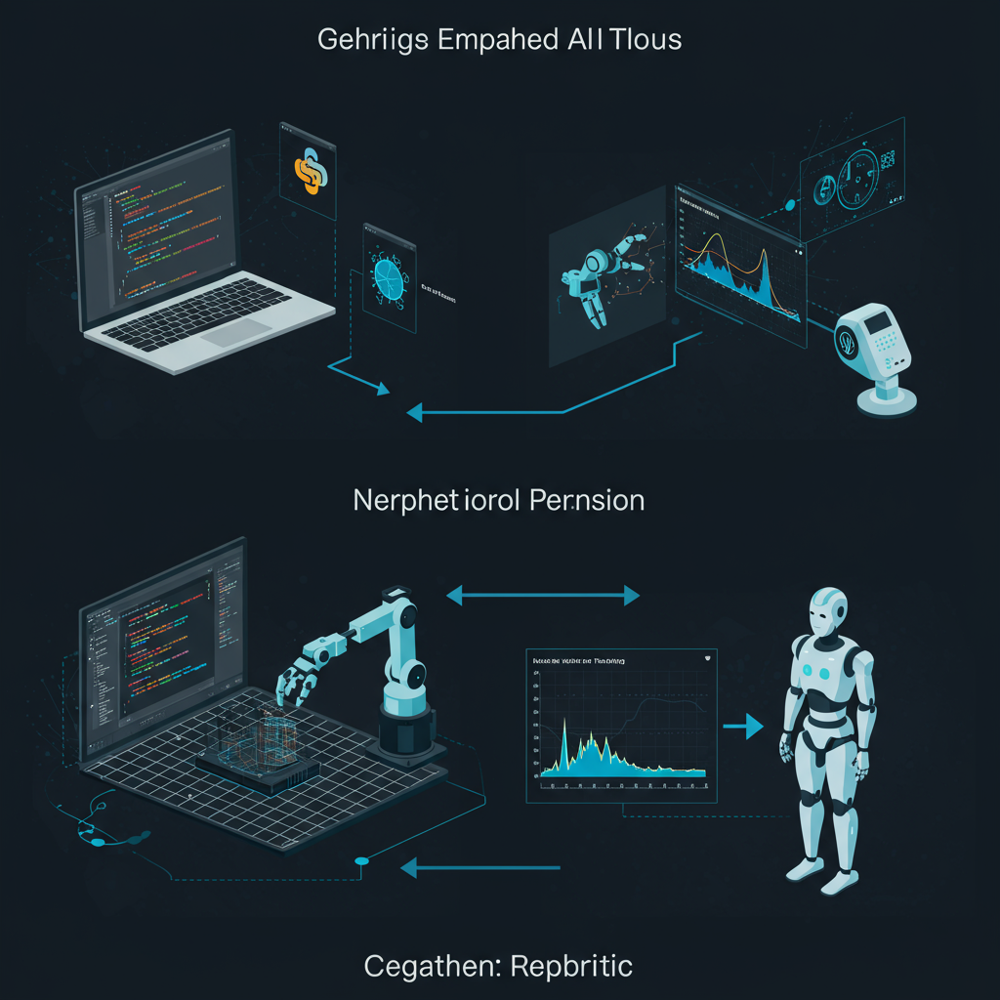
</p>

<p align="center">
  <b>具身智能学习与仿真 Demo</b> — 没有真实机器人也能学机器人 AI
</p>

<p align="center">
  <a href="#快速开始">快速开始</a> &middot;
  <a href="#demo-展示">Demo 展示</a> &middot;
  <a href="#宇树-g1-人形机器人">宇树 G1</a> &middot;
  <a href="#技术栈">技术栈</a> &middot;
  <a href="#学习路线">学习路线</a> &middot;
  <a href="docs/learning_guide.md"><b>学习指南</b></a>
</p>

---

通过 **PyBullet / MuJoCo 物理仿真器**，在你的电脑上运行完整的机器人「感知 → 决策 → 执行」控制流程。训练出的 AI 模型可直接部署到真实机器人上。

## 快速开始

```bash
git clone https://github.com/ava-agent/embodied-agent.git
cd embodied-agent
pip install -r requirements.txt

# 运行第一个 Demo
python demos/01_robot_arm_grasp.py
```

## Demo 展示

### Demo 1: 机械臂抓取

用**逆运动学**控制 Kuka 7-DOF 机械臂分三步抓取红色方块。

| 初始状态 | 接近目标 | 到达抓取位置 |
|:---:|:---:|:---:|
| 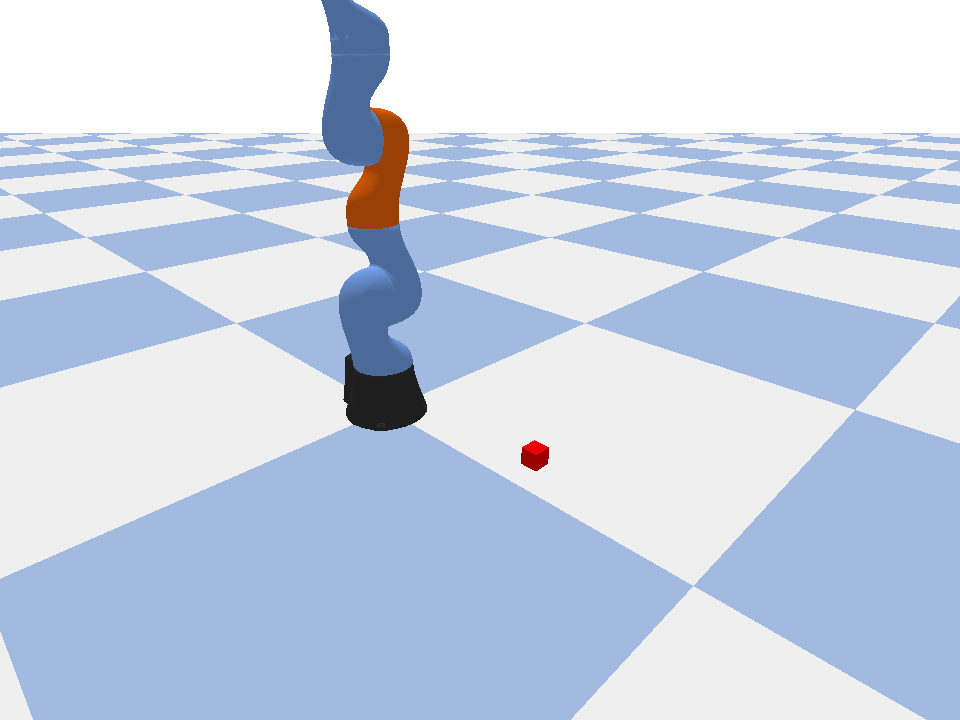 | 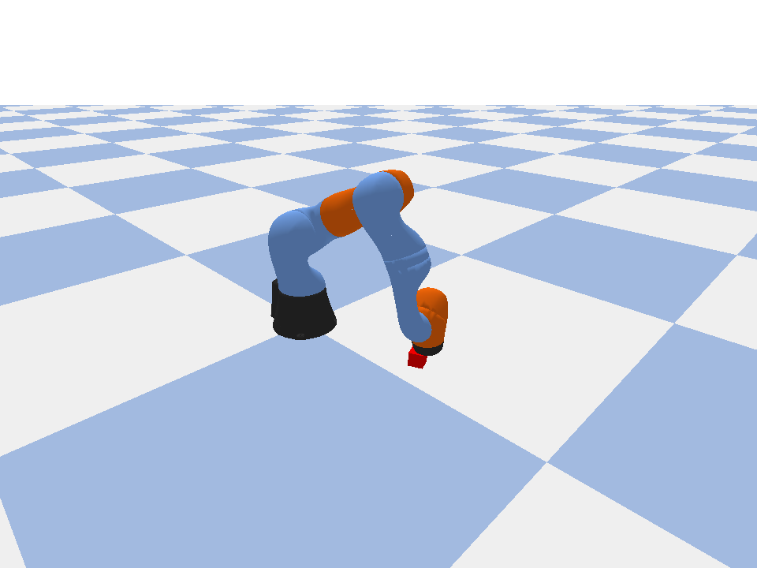 | 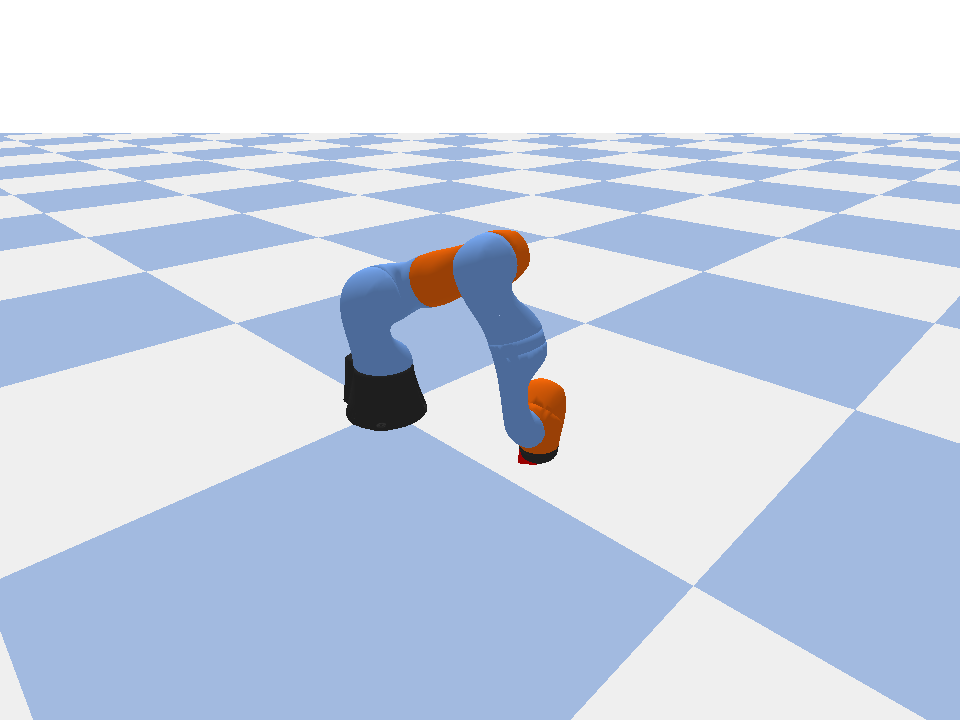 |
| 机械臂直立 | 弯向目标 | 误差 < 2cm |

```bash
python demos/01_robot_arm_grasp.py
```

### Demo 2: 强化学习训练

让**神经网络**通过试错学会控制机械臂。训练完输出 `trained_policy.pt` 模型文件。

```python
obs = env.get_observation()          # 感知（13维向量）
action = policy_network(obs)         # 决策（AI 推理）
env.step(action)                     # 执行（7个关节）
```

```bash
python demos/02_rl_training.py
```

### Demo 3: 模型部署

加载训练好的模型，在仿真中运行，展示仿真 vs 真机的代码对比：

```python
# 仿真                                  # 真机
obs = env.step(action)                   obs = ros_node.get_obs()
action = policy(obs)  # ← 完全一样 →    action = policy(obs)
env.step(action)                         ros_node.send_cmd(action)
```

```bash
python demos/03_deploy_model.py
```

### Demo 4: 宇树 G1 人形机器人动作

用 **PD 力矩控制** 让 G1（29个驱动器）完成一系列全身动作。

| 站立 | 挥手打招呼 | 左拳出击 |
|:---:|:---:|:---:|
| 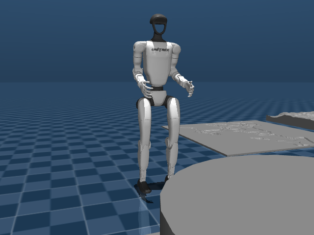 | 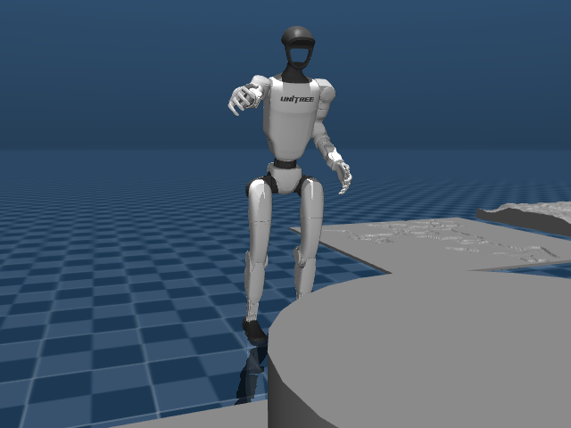 | 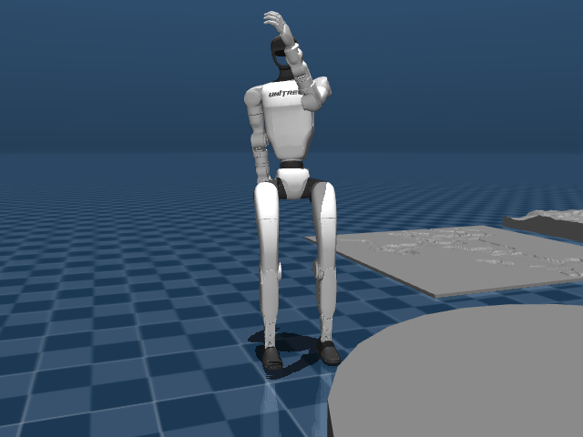 |
| 双腿微弯，PD 控制稳定 | 右臂抬起挥动 | 转腰出拳，重心转移 |

动作序列：站立 → 挥手 → 鞠躬 → 出拳 → 金鸡独立 → 太极起势

```bash
# 需要 conda 环境（含 MuJoCo + 宇树 SDK）
conda activate unitree
mjpython demos/04_g1_actions.py
```

> **为什么有些动作会摔倒？** 出拳和抬腿等剧烈动作用关键帧控制时容易失去平衡。这正是**强化学习的价值**——RL 能学到动态平衡策略，在做动作的同时实时调整全身关节补偿重心偏移。

---

## 宇树 G1 人形机器人

<p align="center">
  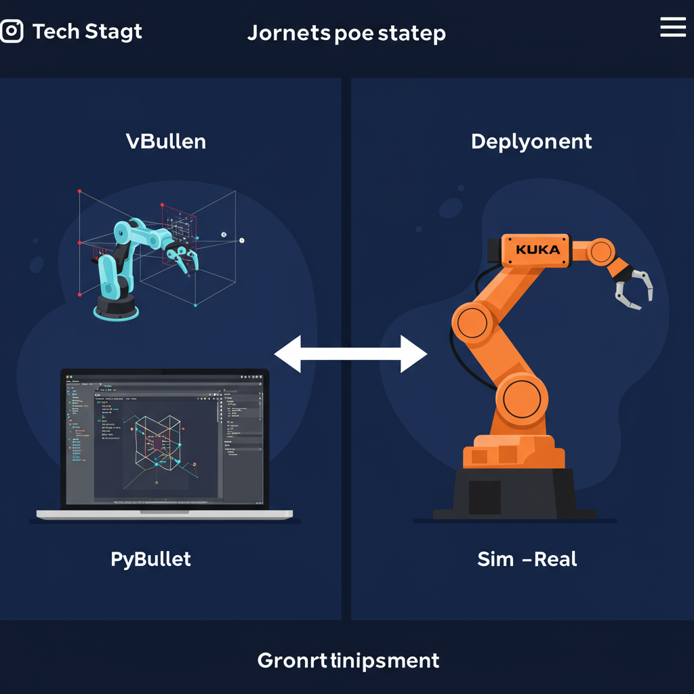
</p>

本项目集成了宇树官方 MuJoCo 仿真，支持 Go2 / G1 / H1 全系列。

| Go2 四足 | G1 人形 | H1 人形 |
|:---:|:---:|:---:|
| 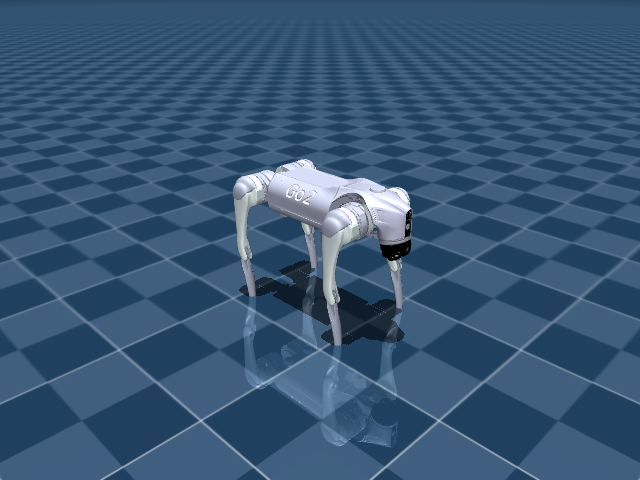 | 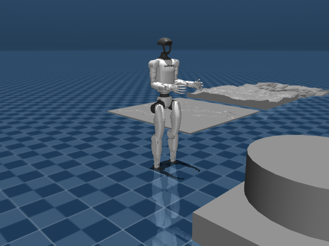 | 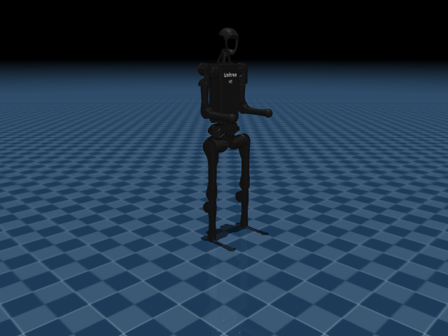 |
| 12 驱动器 | 29 驱动器 | 20 驱动器 |

### 仿真到真机：只改一个参数

```python
# 仿真
ChannelFactory.Instance().Init(0, "lo")      # 本地回环
# 真机
ChannelFactory.Instance().Init(0, "eth0")    # 以太网
# 其他代码完全不变
```

详见 [docs/unitree_dev_guide.md](docs/unitree_dev_guide.md)

---

## 架构

<p align="center">
  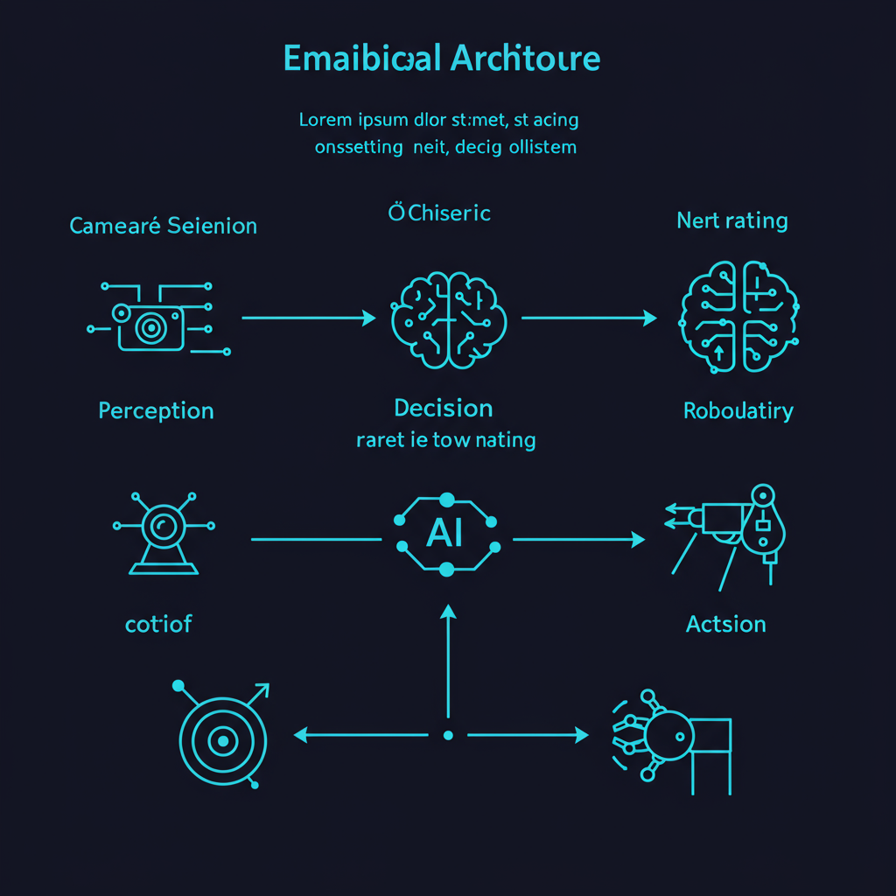
</p>

```
感知 Perception          决策 Decision           执行 Action
─────────────           ─────────────           ─────────────
关节角度+位置             神经网络推理             设置关节目标
相机图像(进阶)           obs → action            电机力矩控制
                         .pt 模型文件
   │                        │                       │
   └─ 仿真: PyBullet API    │                 仿真: data.ctrl
   └─ 真机: ROS 2 Topic     └─ 两边完全一样    真机: CAN → 电机
```

## 技术栈

| 组件 | 本项目 | 生产级 |
|------|-------|-------|
| 物理仿真 | **PyBullet** / **MuJoCo** | Isaac Sim (NVIDIA) |
| AI 框架 | **PyTorch** (19K参数 MLP) | VLA 大模型 (pi0/OpenVLA, 数十亿参数) |
| 机器人 | **Kuka iiwa** / **Unitree G1** | 真实 G1 / Go2 |
| 中间件 | 直接 API 调用 | ROS 2 + MoveIt 2 |
| 部署 | 你的电脑 | Jetson Orin |

## 学习路线

<p align="center">
  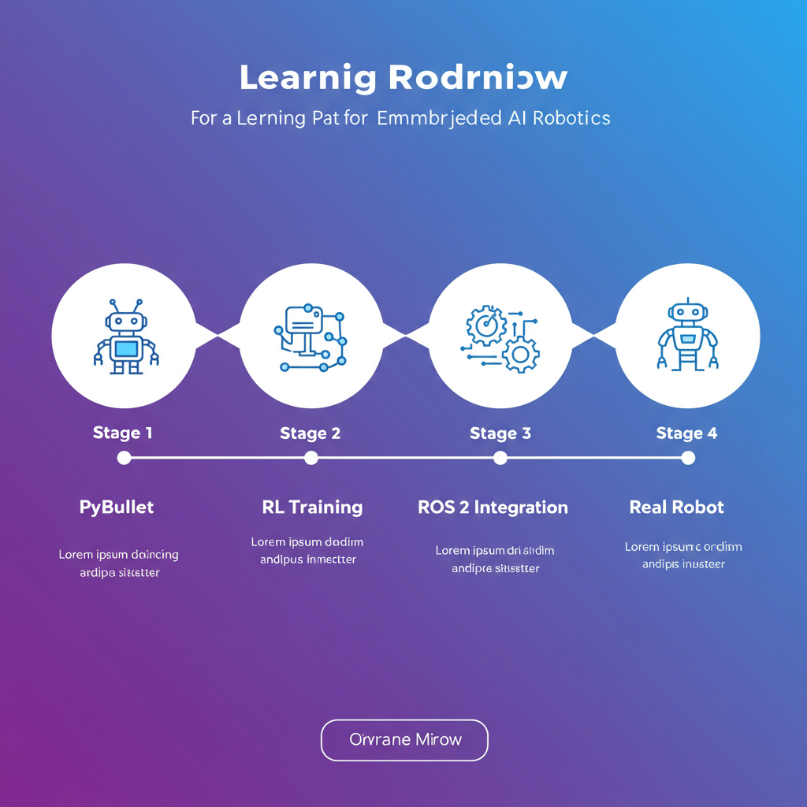
</p>

| 阶段 | 内容 | 时间 |
|------|------|------|
| **1. 本项目** | 运行 4 个 Demo，理解感知→决策→执行 | 1-2 周 |
| **2. 进阶仿真** | MuJoCo + PPO/SAC + 图像输入 | 2-4 周 |
| **3. ROS 2** | Docker 运行 ROS 2，Gazebo 仿真 | 2-4 周 |
| **4. 真机** | 入门机械臂 / 宇树 Go2/G1 | 持续 |

> **完整学习指南**：每个阶段需要掌握的原理、推荐资料、对应 Demo 代码 → [docs/learning_guide.md](docs/learning_guide.md)

## 上真机需要什么

| 条件 | 最低方案 | 推荐方案 |
|------|---------|---------|
| 硬件 | 舵机臂 (~800元) | Unitree G1 (~7.2万) |
| 主控 | 你的电脑 | Jetson Orin Nano (~3K) |
| 传感器 | 编码器(自带) | + RealSense 相机 |
| 中间件 | 串口/SDK | ROS 2 + MoveIt 2 |

## 项目结构

```
embodied-agent/
├── demos/
│   ├── 01_robot_arm_grasp.py       # 逆运动学抓取 (PyBullet)
│   ├── 02_rl_training.py           # 强化学习训练 (PyTorch)
│   ├── 03_deploy_model.py          # 模型部署对比
│   ├── 04_g1_actions.py            # 宇树 G1 动作演示 (MuJoCo)
│   └── rl_training.py              # 共享模块
├── docs/
│   ├── tech_stack.md               # 技术栈全景
│   └── unitree_dev_guide.md        # 宇树开发指南
├── assets/                         # 图示 + 仿真截图
├── requirements.txt
└── README.md
```

## 相关资源

| 资源 | 链接 |
|------|------|
| PyBullet | [pybullet.org](https://pybullet.org/) |
| MuJoCo | [mujoco.readthedocs.io](https://mujoco.readthedocs.io/) |
| 宇树 SDK | [unitree_sdk2_python](https://github.com/unitreerobotics/unitree_sdk2_python) |
| 宇树仿真 | [unitree_mujoco](https://github.com/unitreerobotics/unitree_mujoco) |
| 宇树 RL | [unitree_rl_gym](https://github.com/unitreerobotics/unitree_rl_gym) |
| ROS 2 | [docs.ros.org](https://docs.ros.org/en/jazzy/) |
| Isaac Sim | [developer.nvidia.com](https://developer.nvidia.com/isaac-sim) |
| Open X-Embodiment | [robotics-transformer-x](https://robotics-transformer-x.github.io/) |
