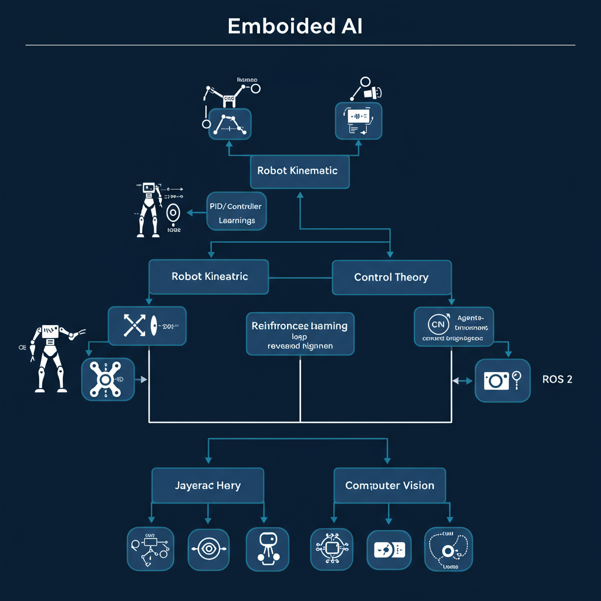
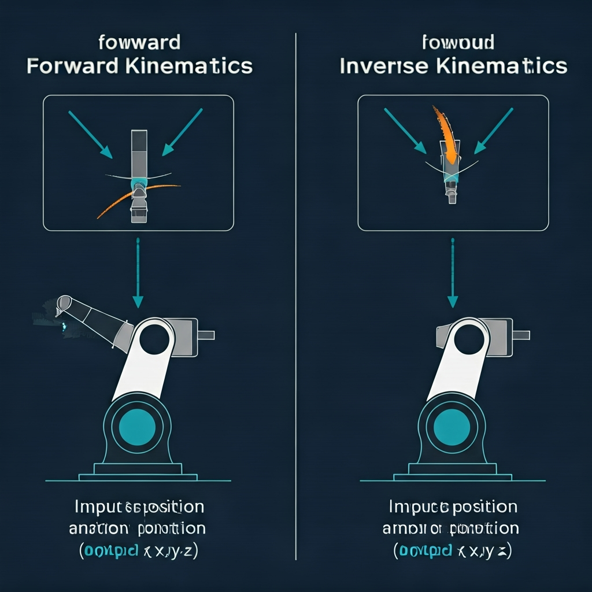
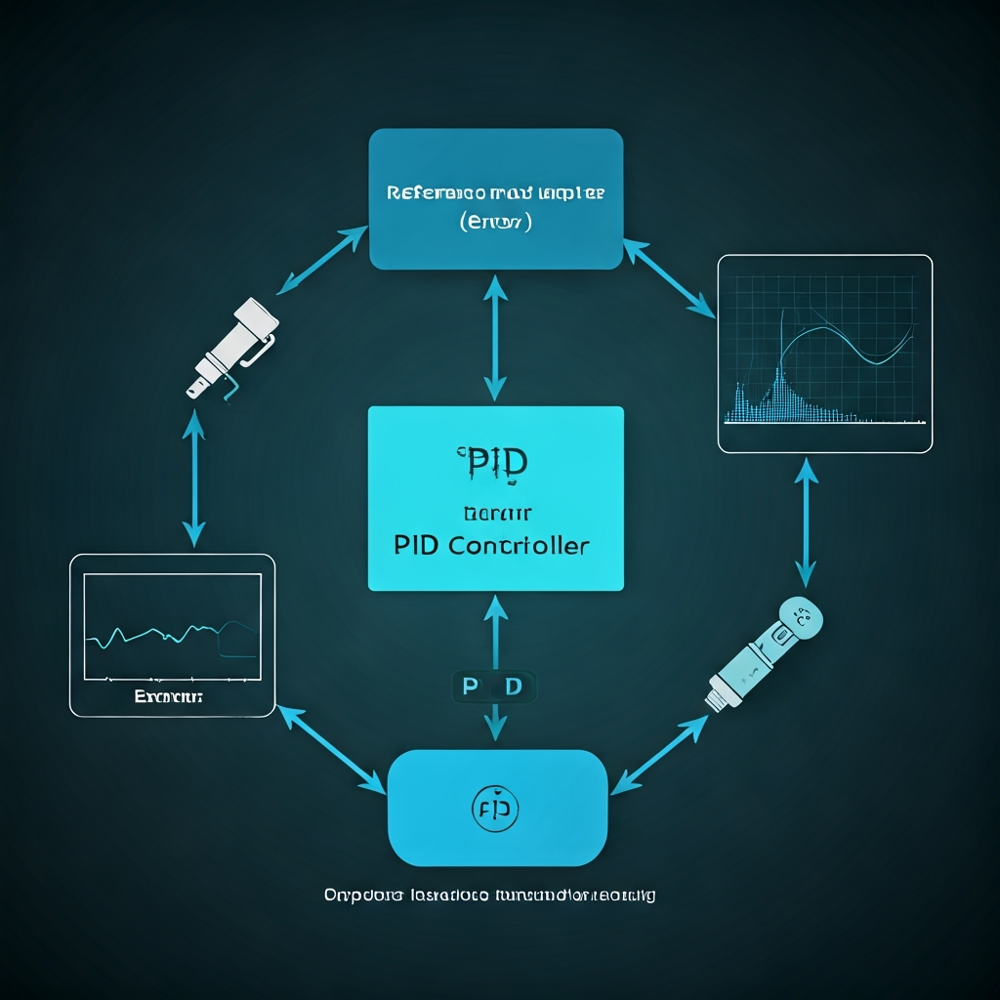
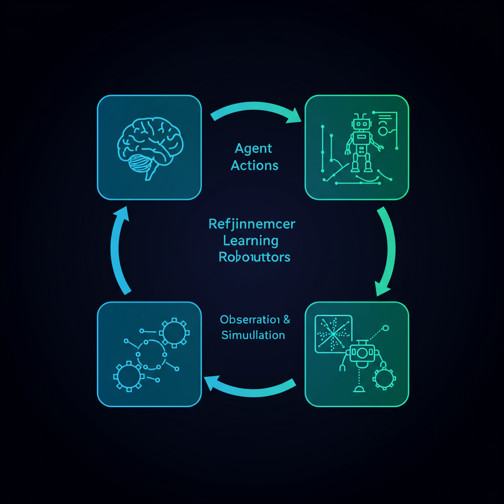
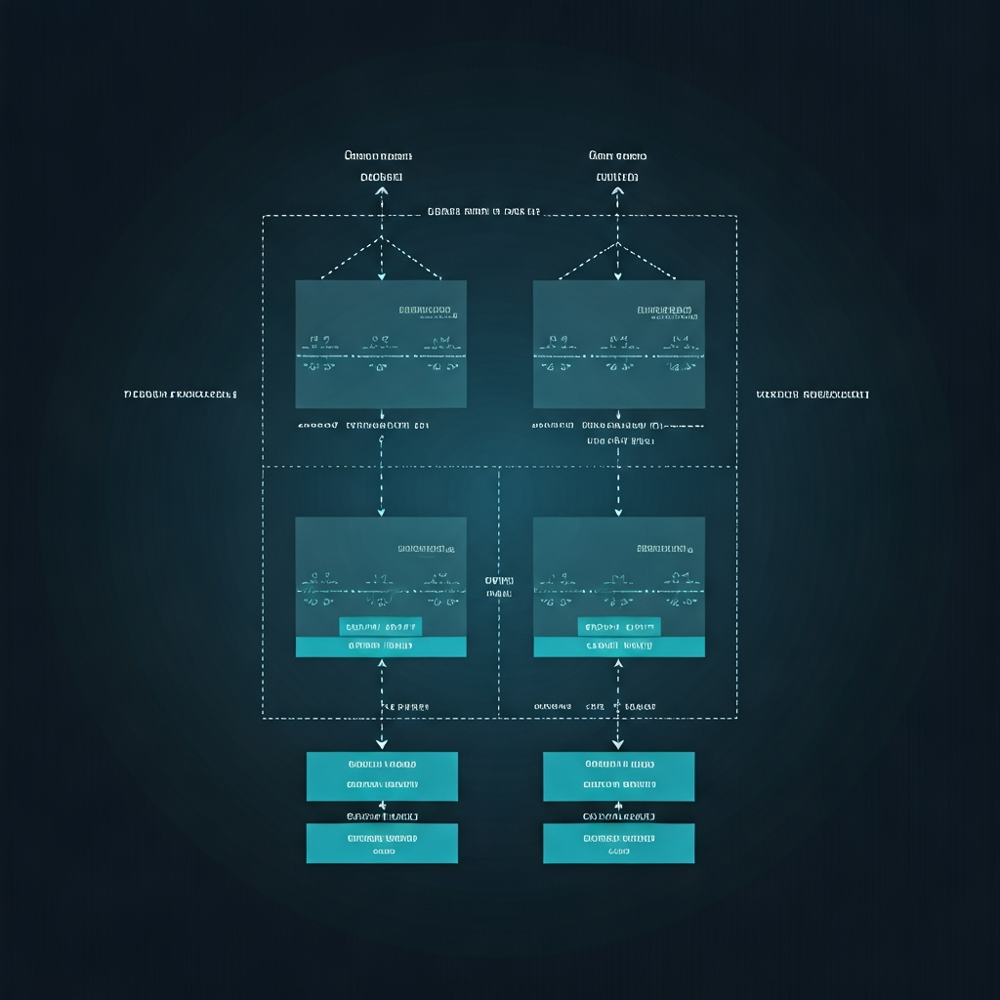
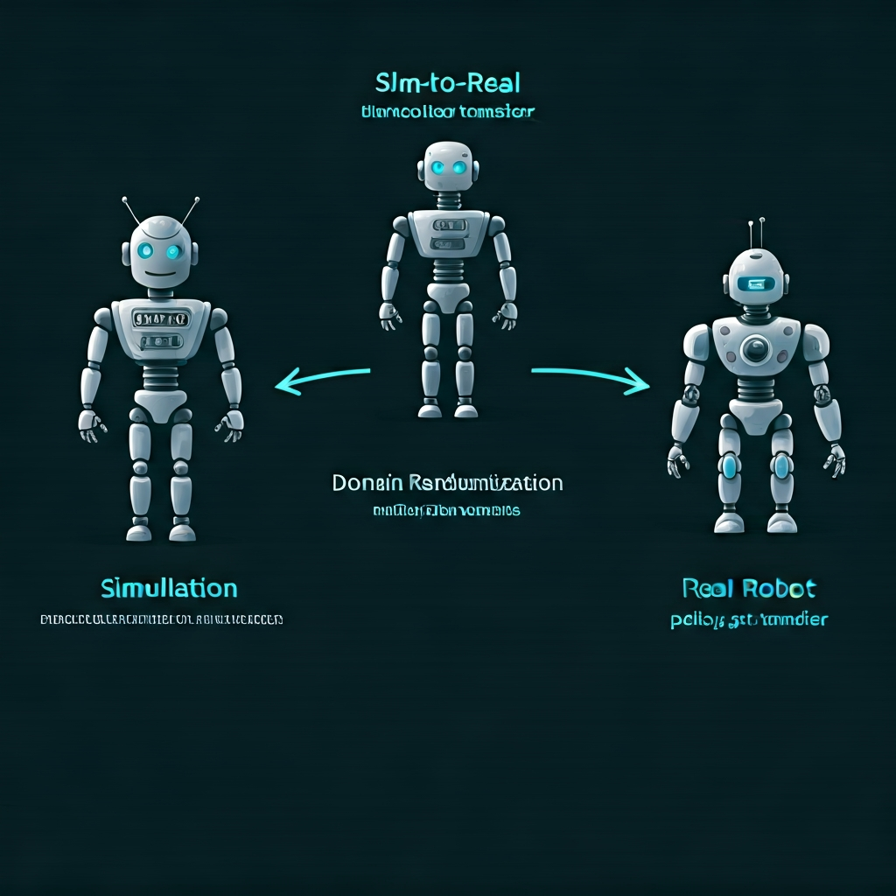

# 具身智能完整学习指南

> 读完本文档，你将掌握具身智能所有核心原理。每个概念都在文档内讲透，配代码和图示。

<p align="center">
  
</p>

---

## 目录

- [模块 1: 机器人学基础](#模块-1-机器人学基础) — 机器人怎么动？
- [模块 2: 控制理论](#模块-2-控制理论) — 怎么让它精确地动？
- [模块 3: 强化学习](#模块-3-强化学习) — 怎么让它自己学会动？
- [模块 4: 计算机视觉](#模块-4-计算机视觉) — 怎么让它看见世界？
- [模块 5: ROS 2 系统](#模块-5-ros-2-系统) — 怎么把一切连起来？
- [模块 6: Sim-to-Real](#模块-6-sim-to-real) — 怎么从仿真到真机？
- [数学速查](#数学速查)
- [学习计划](#学习计划)

---

# 模块 1: 机器人学基础

> **核心问题**：一个有 N 个关节的机器人，怎么从 A 点移动到 B 点？

## 1.1 关节与自由度

机器人的"骨架"由**连杆（Link）**和**关节（Joint）**组成：

```
连杆: 刚性的"骨头"，不会变形
关节: 连接两根连杆，允许相对运动

关节类型:
┌──────────────────────────────────────────────┐
│  旋转关节 (Revolute)  — 像手肘，绕轴转动      │  ← 最常见
│  平移关节 (Prismatic) — 像抽屉，沿轴滑动      │
│  球形关节 (Ball)      — 像肩膀，多方向转动     │
│  固定关节 (Fixed)     — 不能动，纯连接用       │
└──────────────────────────────────────────────┘
```

**自由度 (DOF, Degrees of Freedom)**：机器人能独立运动的维度数量。

| 机器人 | 自由度 | 含义 |
|--------|--------|------|
| Kuka iiwa (Demo 1) | 7 | 7 个旋转关节，手臂能到达空间中任意位置和姿态 |
| 宇树 G1 (Demo 4) | 29 个驱动器 | 腿×12 + 腰×3 + 臂×14 = 全身运动 |
| 人类手臂 | ~7 | 肩(3) + 肘(1) + 腕(3)，和 Kuka 类似 |

为什么 Kuka 是 7-DOF 而不是 6？因为 6-DOF 刚好能确定末端的位置(xyz)+姿态(rpy)，第 7 个自由度提供了**冗余**——同一个目标位置可以有多种关节姿态，方便避障。

## 1.2 关节空间 vs 笛卡尔空间

这是机器人学最核心的概念——两种描述机器人状态的方式：

```
关节空间 (Joint Space)                笛卡尔空间 (Cartesian Space)
━━━━━━━━━━━━━━━━━━━                 ━━━━━━━━━━━━━━━━━━━━━━━━━━
θ = [θ₁, θ₂, θ₃, ..., θ₇]          P = [x, y, z, roll, pitch, yaw]

"每个关节转了多少度"                   "末端（手）在3D空间中的位置和姿态"

维度 = 关节数 (7)                     维度 = 6 (位置3 + 姿态3)
对电机友好（直接控制）                  对人类友好（直觉理解）
```

**你指挥机器人"去那个位置"（笛卡尔），但电机只懂"转多少度"（关节）。** 两个空间之间的转换就是正/逆运动学。

## 1.3 正运动学与逆运动学

<p align="center">
  
</p>

### 正运动学 (Forward Kinematics, FK)

**已知每个关节角度 → 计算末端位置。**

这是"简单"的方向——给定所有关节角度，通过矩阵连乘算出末端在哪：

```
原理：每个关节贡献一个变换矩阵 T

T_total = T₁(θ₁) × T₂(θ₂) × T₃(θ₃) × ... × T₇(θ₇)

末端位置 = T_total 的平移部分
末端姿态 = T_total 的旋转部分
```

用一个 2 关节平面机器人举例：

```
关节1在原点，臂长L₁，角度θ₁
关节2在关节1末端，臂长L₂，角度θ₂

末端x = L₁·cos(θ₁) + L₂·cos(θ₁ + θ₂)
末端y = L₁·sin(θ₁) + L₂·sin(θ₁ + θ₂)

这就是正运动学——给角度，算位置。
```

在 Demo 1 中，PyBullet 的 `getLinkState()` 就是在做正运动学：
```python
# PyBullet 内部做了正运动学，返回末端位置
state = p.getLinkState(robot_id, 6)  # 第6个连杆（末端）
end_effector_pos = state[0]          # (x, y, z)
```

### 逆运动学 (Inverse Kinematics, IK)

**已知目标位置 → 计算需要的关节角度。**

这是"困难"的方向——给定想去的位置，反推每个关节该转多少度：

```
已知: 目标位置 P_target = [x, y, z]
求解: θ = [θ₁, θ₂, ..., θ₇] 使得 FK(θ) = P_target

难点:
  1. 方程是非线性的（含sin/cos）
  2. 可能有多个解（多种姿态到达同一点）
  3. 可能无解（目标超出工作范围）
  4. 7-DOF时有无穷多解（冗余自由度）
```

求解方法（从简单到复杂）：

| 方法 | 原理 | 适用场景 |
|------|------|---------|
| **解析解** | 对特定结构直接推导公式 | 6-DOF 工业臂（结构规整） |
| **数值迭代（雅可比）** | 每步微调关节角度逼近目标 | 通用方法，Demo 1 用的就是这个 |
| **神经网络** | 训练一个网络学习 IK 映射 | 研究中，不如传统方法可靠 |

Demo 1 中 PyBullet 帮你做了 IK 求解：
```python
# 输入目标位置，输出关节角度
joint_angles = p.calculateInverseKinematics(
    robot_id,           # 哪个机器人
    6,                  # 末端连杆索引
    target_pos          # 目标 [x, y, z]
)
# joint_angles = [θ₁, θ₂, θ₃, θ₄, θ₅, θ₆, θ₇]
```

**雅可比矩阵**（数值 IK 的核心）：

```
雅可比矩阵 J 描述了"关节微小变化"如何导致"末端微小变化"：

  Δx = J · Δθ    (末端位移 = 雅可比 × 关节角度变化)

逆运动学就是反过来求：
  Δθ = J⁻¹ · Δx  (要移动 Δx，关节需要变化 Δθ)

然后迭代：θ_new = θ_old + Δθ，直到末端到达目标。
```

## 1.4 URDF 模型

URDF (Unified Robot Description Format) 是用 XML 描述机器人"身体"的标准格式：

```xml
<!-- 简化的两关节机器人 URDF -->
<robot name="simple_arm">

  <!-- 连杆（骨头）-->
  <link name="base">
    <visual>
      <geometry><box size="0.1 0.1 0.1"/></geometry>  <!-- 形状 -->
    </visual>
    <inertial>
      <mass value="1.0"/>                              <!-- 质量 -->
      <inertia ixx="0.01" iyy="0.01" izz="0.01"/>     <!-- 惯性矩 -->
    </inertial>
  </link>

  <link name="upper_arm">
    <visual>
      <geometry><cylinder length="0.5" radius="0.02"/></geometry>
    </visual>
    <inertial>
      <mass value="0.5"/>
    </inertial>
  </link>

  <!-- 关节 -->
  <joint name="shoulder" type="revolute">       <!-- 旋转关节 -->
    <parent link="base"/>                        <!-- 父连杆 -->
    <child link="upper_arm"/>                    <!-- 子连杆 -->
    <axis xyz="0 0 1"/>                          <!-- 旋转轴(Z轴) -->
    <limit lower="-3.14" upper="3.14"            <!-- 角度范围 -->
           effort="100" velocity="2.0"/>          <!-- 最大力矩和速度 -->
  </joint>

</robot>
```

URDF 中每个 `<link>` 需要定义三个方面：
- **visual**：渲染外观（你看到的样子）
- **collision**：碰撞体（物理引擎用来检测碰撞）
- **inertial**：质量和惯性矩（物理引擎用来计算动力学）

Demo 1 中加载 Kuka 的 URDF：
```python
robot_id = p.loadURDF("kuka_iiwa/model.urdf", [0,0,0], useFixedBase=True)
# PyBullet 读取 URDF，在仿真中创建对应的物理模型
# 此后所有的关节控制、碰撞检测都基于这个模型
```

## 1.5 动力学

运动学回答"怎么动"，动力学回答"需要多大的力"：

```
正动力学: 给定力矩 τ → 计算加速度 q̈
  q̈ = M(q)⁻¹ · (τ - C(q,q̇) - G(q))

  M(q)   = 质量矩阵（惯性）
  C(q,q̇) = 科氏力和离心力
  G(q)   = 重力项

逆动力学: 给定期望加速度 q̈ → 计算需要的力矩 τ
  τ = M(q)·q̈ + C(q,q̇) + G(q)
```

**你不需要手动算这些——PyBullet/MuJoCo 的物理引擎每一步都在自动计算。** 但理解这个公式有助于理解为什么：
- 腿部关节需要更大的 Kp（要克服重力 G(q)）
- 快速运动时更难控制（科氏力 C 变大）
- 大质量连杆需要更大力矩（M 更大）

---

# 模块 2: 控制理论

> **核心问题**：知道了目标角度，怎么让电机精确、快速、稳定地转到那个角度？

<p align="center">
  
</p>

## 2.1 为什么需要控制器

你不能直接让电机"瞬移"到目标角度。电机只能施加**力矩（扭力）**，让关节加速、减速、最终停在目标位置。控制器的任务是计算每一时刻需要施加多大的力矩。

```
如果没有控制器，直接给最大力矩：
  → 关节会冲过目标位置（overshoot）
  → 然后反向冲过（oscillation）
  → 持续震荡，永远停不下来

好的控制器：
  → 远离目标时：大力矩，快速接近
  → 接近目标时：减小力矩，慢慢停下
  → 到达目标时：微小力矩，维持位置
```

## 2.2 PD 控制（Demo 4 的核心）

PD 控制器是机器人中**最常用**的控制器，只需要两个参数：

```python
# PD 控制的核心公式（Demo 4 的全部控制逻辑）
error = target_angle - current_angle           # 位置误差
velocity = current_angular_velocity            # 当前角速度

torque = Kp * error - Kd * velocity
#        ────────    ─────────────
#        比例项P      微分项D
```

**Kp（比例增益）**——"弹簧"：
```
误差越大 → 力矩越大 → 回到目标越快

类比：橡皮筋拉得越长，弹力越大

Kp 太小: 响应慢，需要很久才到目标位置
Kp 太大: 响应快但震荡（像弹簧弹来弹去）
```

**Kd（微分增益）**——"阻尼"：
```
速度越快 → 阻力越大 → 防止冲过头

类比：液压阻尼器，运动越快阻力越大

Kd 太小: 关节到达目标后震荡
Kd 太大: 关节运动迟缓
```

**直觉理解：PD 控制 = 弹簧 + 阻尼器**

```
            ┌─── 弹簧 (Kp): 把关节拉向目标
            │
目标角度 ←──┤
            │
            └─── 阻尼器 (Kd): 防止震荡

当前角度 ──→
```

## 2.3 PID 控制（增加积分项）

PID 多了一个 I（积分）项：

```python
# PID 控制
error = target - current
integral += error * dt                          # 累积误差

torque = Kp * error + Ki * integral - Kd * velocity
#                      ───────────
#                       积分项I
```

**Ki（积分增益）**——"固执的纠错者"：
```
如果有持续的小误差（比如重力导致下垂），
P 项产生的力矩恰好等于重力，无法再修正误差。
I 项会累积这个误差，逐渐增大力矩，直到误差为零。

Ki 太小: 稳态误差消除慢
Ki 太大: 积分饱和，导致震荡
```

**机器人中 PD 比 PID 更常见**，因为：
1. 积分项可能导致 windup（积分饱和）
2. 机器人关节不需要零稳态误差（RL 策略会补偿）
3. PD 更简单、更稳定

## 2.4 参数调节

Demo 4 中不同关节的增益不同：

```python
# 腿部: 高刚度（要支撑35kg体重）
kp[腿] = 200.0    # 大弹簧
kd[腿] = 10.0     # 大阻尼

# 手臂: 低刚度（不需要支撑重量）
kp[臂] = 40.0     # 小弹簧
kd[臂] = 2.0      # 小阻尼
```

**调参经验法则**（Ziegler-Nichols 简化版）：

```
1. 先设 Kd = 0
2. 逐渐增大 Kp，直到关节开始震荡
3. 把 Kp 降到震荡值的 60%
4. 逐渐增大 Kd，直到震荡消失且响应足够快
```

## 2.5 位置控制 vs 力矩控制

| 模式 | Demo 1 | Demo 4 |
|------|--------|--------|
| 类型 | 位置控制 | 力矩控制 |
| 你告诉电机 | "请转到 0.5 rad" | "请施加 50 N·m 的力矩" |
| PD 控制在哪 | 电机内部自带 PD | 你自己写 PD |
| 灵活性 | 低（黑盒） | 高（可以做任何控制策略） |
| 难度 | 简单 | 难（需要理解动力学） |

```python
# Demo 1: 位置控制（简单，电机自己搞定）
p.setJointMotorControl2(robot, i, p.POSITION_CONTROL,
    targetPosition=0.5)  # "请去0.5 rad"

# Demo 4: 力矩控制（灵活，你来计算力矩）
torque = kp * (target - current) - kd * velocity
data.ctrl[i] = torque    # "请施加这么大的力矩"
```

## 2.6 为什么 Demo 4 的剧烈动作会摔倒

```
PD 控制的局限：每个关节独立追踪目标，不考虑全身平衡

当 G1 抬起一条腿：
  → 重心偏移到支撑脚外侧
  → 没有任何机制将重心移回支撑面内
  → 倒了

解决方案（进阶）：
  1. ZMP 控制: 计算零力矩点，保持在支撑多边形内
  2. 全身动力学控制: 同时优化所有关节，兼顾任务和平衡
  3. 强化学习: 让 AI 自动学会平衡（模块3的内容）
```

---

# 模块 3: 强化学习

> **核心问题**：不写规则，让机器人通过试错自己学会走路/抓东西/保持平衡。

<p align="center">
  
</p>

## 3.1 什么是强化学习

强化学习的核心思想：**Agent（智能体）在环境中执行动作，获得奖励/惩罚，通过最大化累积奖励来学习最优策略。**

```
人类教小孩走路:
  走一步没摔倒 → 鼓掌（正奖励）  → 小孩记住这个动作
  摔倒了       → 痛（负奖励）    → 小孩下次避免这个动作
  反复几千次后  → 学会走路

RL 教机器人走路:
  前进一步没倒 → +1 奖励         → 更新策略
  摔倒了       → -10 惩罚        → 更新策略
  反复几百万次  → 学会走路（在仿真中）
```

## 3.2 核心概念

### 马尔可夫决策过程 (MDP)

RL 问题被形式化为 MDP，由五个元素组成：

```
(S, A, P, R, γ)

S — 状态空间: 机器人所有可能的状态
    Demo 2 中: [7个关节角度, 3个末端坐标, 3个目标坐标] = 13维向量

A — 动作空间: 机器人所有可能的动作
    Demo 2 中: [7个关节角速度增量] = 7维向量

P — 转移概率: 执行动作后，环境变成什么状态
    由物理引擎决定（重力、碰撞等）

R — 奖励函数: 评价每一步的好坏
    Demo 2 中: -distance（离目标越近越好）

γ — 折扣因子: 未来奖励的衰减系数 (0~1)
    Demo 2 中: 0.99（重视长远回报）
```

### 策略 (Policy)

策略 π 是 RL 的核心输出——给定当前状态，输出应该执行的动作：

```
π(s) → a    "看到状态 s，做动作 a"

在 Demo 2 中，策略就是一个神经网络:
  输入: 13维观测向量 [关节角度, 末端位置, 目标位置]
  输出: 7维动作向量 [每个关节的角速度增量]
```

### 回报 (Return)

回报是从当前时刻开始的**折扣累积奖励**：

```
G_t = r_t + γ·r_{t+1} + γ²·r_{t+2} + ...

r_t     = 当前奖励
γ       = 折扣因子 (0.99)
γ·r     = 下一步奖励打 1% 折扣
γ²·r    = 再下一步打 2% 折扣
...

为什么要折扣？
  → 如果不折扣，回报可能是无穷大
  → 折扣让 AI 更重视近期奖励（"明天的奖励不如今天的确定"）
```

## 3.3 策略网络

<p align="center">
  
</p>

Demo 2 的策略网络结构：

```python
class PolicyNetwork(nn.Module):
    def __init__(self):
        super().__init__()
        self.network = nn.Sequential(
            nn.Linear(13, 128),    # 输入层 → 隐藏层1
            nn.ReLU(),             # 激活函数
            nn.Linear(128, 128),   # 隐藏层1 → 隐藏层2
            nn.ReLU(),
            nn.Linear(128, 7),     # 隐藏层2 → 输出层
            nn.Tanh()              # 输出范围 [-1, 1]
        )
```

**逐层解释**：

```
输入 [13维]                     含义
──────────                     ──────
obs[0:7]   = 关节角度           机器人当前姿态
obs[7:10]  = 末端 xyz           手在哪里
obs[10:13] = 目标 xyz           目标在哪里

   ↓ nn.Linear(13, 128)        全连接: 每个输入和128个神经元相连
   ↓ ReLU()                    激活: max(0, x)，引入非线性
   ↓ nn.Linear(128, 128)       第二层全连接
   ↓ ReLU()
   ↓ nn.Linear(128, 7)         输出7个值
   ↓ Tanh()                    压缩到 [-1, 1]

输出 [7维]                      含义
──────────                     ──────
action[0:7] = 关节角速度增量     每个关节转快/转慢多少
```

**为什么用 Tanh？** 因为动作需要有界——关节不能无限快地转动。Tanh 把输出压缩到 [-1, 1]，再乘以缩放系数得到实际角速度。

## 3.4 奖励设计（最重要的部分）

**奖励函数决定了 AI 学到什么行为。** 同一个算法，不同的奖励函数会训练出完全不同的策略。

Demo 2 的奖励设计：

```python
# 基础奖励: 负的距离（离目标越近奖励越高）
reward = -distance

# 到达附近: 额外奖励
if distance < 0.05:
    reward += 10.0

# 非常精确: 超大奖励
if distance < 0.02:
    reward += 50.0
```

**奖励设计的技巧**：

```
好的奖励设计:                        坏的奖励设计:
─────────────                       ─────────────
1. 稠密奖励（每步都有反馈）            稀疏奖励（只有最终成功才有奖励）
   → -distance 每步都变化               → 只在抓到物体时+1
   → AI知道自己在进步                    → AI很难学会（大部分时候没反馈）

2. 分层奖励（越好奖励越大）
   → < 0.05m: +10
   → < 0.02m: +50
   → 引导AI不断精进

3. 惩罚不良行为
   → 碰到自己: -5
   → 超出关节限制: -5
   → 避免学到"作弊"的策略
```

**宇树 G1 行走的奖励设计**（unitree_rl_gym 中的实际设计）：

```python
# 行走奖励 = 多个子奖励的加权和
reward = (
    1.0  * tracking_linear_velocity    # 跟踪目标速度
  + 0.5  * tracking_angular_velocity   # 跟踪目标转向
  - 0.01 * linear_velocity_z           # 惩罚垂直方向晃动
  - 0.05 * angular_velocity_xy         # 惩罚身体摇晃
  - 0.01 * torque_penalty              # 惩罚过大力矩（省电）
  - 2.0  * feet_stumble                # 惩罚绊倒
  - 1.0  * action_smoothness           # 惩罚动作突变（看起来更自然）
)
```

## 3.5 策略梯度（Demo 2 使用的算法）

策略梯度是最基本的 RL 算法。核心思想：**如果一个动作获得了高回报，就增加执行这个动作的概率。**

```
算法步骤:
1. 用当前策略 π 收集一批经验 (s, a, r)
2. 计算每个时刻的回报 G_t
3. 计算策略梯度:
   ∇J = Σ (∇log π(a|s) · G_t)
       "高回报的动作 → 增大概率"
       "低回报的动作 → 减小概率"
4. 更新策略: θ = θ + α · ∇J

用大白话说:
  "做了一个动作，结果很好 → 下次更可能这么做"
  "做了一个动作，结果不好 → 下次更不可能这么做"
```

Demo 2 的训练代码：

```python
# 收集一轮经验
for step in range(200):
    action = policy(obs)                  # 策略输出动作
    noise = torch.randn_like(action)      # 添加探索噪声
    noisy_action = action + noise
    log_prob = -0.5 * (noise ** 2).sum()  # 记录概率
    obs, reward, done, _ = env.step(noisy_action)

# 计算回报
returns = []
R = 0
for r in reversed(rewards):
    R = r + 0.99 * R          # 折扣累积
    returns.insert(0, R)

# 策略梯度更新
loss = 0
for log_prob, R in zip(log_probs, returns):
    loss -= log_prob * R       # 高回报 → 增大该动作概率

optimizer.zero_grad()
loss.backward()                # 反向传播计算梯度
optimizer.step()               # 更新网络权重
```

## 3.6 PPO（生产级算法）

PPO (Proximal Policy Optimization) 是当前**最常用**的 RL 算法，也是宇树训练 G1 走路用的算法。它在策略梯度的基础上做了一个关键改进：

```
策略梯度的问题:
  一次更新可能步子迈太大 → 策略突然变差 → 再也学不回来

PPO 的解决方案:
  限制每次更新的幅度 → "小步快跑"

  ratio = π_new(a|s) / π_old(a|s)   # 新旧策略的概率比

  clip(ratio, 1-ε, 1+ε)              # 限制比值在 [0.8, 1.2] 内
                                      # ε 通常取 0.2

  直觉: "每次更新，新策略不能偏离旧策略太远"
```

**PPO vs 策略梯度**：

| 维度 | 策略梯度 (Demo 2) | PPO |
|------|------------------|-----|
| 更新稳定性 | 不稳定，经常崩溃 | 稳定，不容易崩 |
| 样本效率 | 低（需要更多数据） | 较高 |
| 超参数敏感性 | 高 | 低 |
| 实际应用 | 教学用 | 工业标准 |

## 3.7 探索与利用

```
探索 (Exploration): 尝试新的、未知的动作
利用 (Exploitation): 执行目前已知最好的动作

如果只探索: 永远在随机乱动，不会收敛
如果只利用: 可能陷入局部最优（比如原地不动也不会摔倒）

Demo 2 的探索策略:
  action = policy(obs) + noise * scale    # 在策略输出上加噪声
  scale = 0.3 * (1 - episode/total)       # 噪声随训练逐渐减小
  # 早期: 大量探索（噪声大）
  # 后期: 主要利用（噪声小）
```

---

# 模块 4: 计算机视觉

> **核心问题**：让机器人用相机看见世界，而不是依赖人工提供的坐标。

## 4.1 状态策略 vs 视觉策略

```
Demo 1-4 的方式（状态策略）:
  输入: [关节角度, 末端坐标, 目标坐标]  ← 需要人工告诉目标在哪
  简单，但不能自主发现目标

进阶方式（视觉策略）:
  输入: 相机拍摄的 RGB 图像 (480×640×3)  ← 机器人自己"看"
  复杂，但可以自主理解场景
```

## 4.2 卷积神经网络 (CNN)

CNN 是处理图像的标准神经网络架构：

```
输入图像 (480×640×3)

  ↓ Conv2D(3→32, kernel=5)    # 卷积层: 提取边缘、颜色等底层特征
  ↓ ReLU + MaxPool(2)         # 激活 + 下采样 (240×320×32)

  ↓ Conv2D(32→64, kernel=3)   # 卷积层: 提取纹理、形状等中层特征
  ↓ ReLU + MaxPool(2)         # (120×160×64)

  ↓ Conv2D(64→128, kernel=3)  # 卷积层: 提取物体、部件等高层特征
  ↓ ReLU + MaxPool(2)         # (60×80×128)

  ↓ Flatten                   # 展平为一维向量
  ↓ Linear(→256)              # 全连接层
  ↓ Linear(→7)                # 输出: 关节动作
```

**卷积的直觉**：

```
卷积核（filter）就像一个小窗口在图像上滑动:

原始图像         3×3 卷积核        输出
┌───────────┐   ┌─────┐
│ 1 0 1 0 1 │   │ 1 0 │    滑动卷积核，每个位置
│ 0 1 0 1 0 │ ★ │ 0 1 │ =  计算窗口内的加权和
│ 1 0 1 0 1 │   │ 1 0 │    → 提取局部特征
└───────────┘   └─────┘

第一层卷积: 检测边缘（水平线、垂直线、对角线）
第二层卷积: 检测纹理（角、圆弧、网格）
第三层卷积: 检测物体部件（杯子把手、桌面边缘）
```

## 4.3 VLA 模型（2025年前沿）

VLA (Vision-Language-Action) 模型统一了视觉、语言和动作：

```
输入: 相机图像 + 语言指令 "把红色杯子放到桌上"
  │
  ├── 视觉编码器 (ViT): 理解图像中有什么、在哪里
  ├── 语言编码器 (LLM): 理解"红色杯子"和"放到桌上"的含义
  │
  ↓ 多模态融合
  │
  ↓ 动作解码器: 输出关节角度序列
  │
输出: [Δθ₁, Δθ₂, ..., Δθ₇]  (每个时间步的关节增量)
```

代表性模型：
- **RT-2** (Google): 将动作编码为 token，复用 LLM 架构
- **OpenVLA** (Stanford): 开源 7B VLA，覆盖 22 种机器人
- **pi0** (Physical Intelligence): 当前性能最强的 VLA

---

# 模块 5: ROS 2 系统

> **核心问题**：感知、决策、控制是不同的程序，怎么让它们协同工作？

## 5.1 为什么需要 ROS 2

```
Demo 1-4 的方式: 所有逻辑在一个 Python 文件里
  感知() → 决策() → 执行()  # 函数调用

真实机器人: 不同模块在不同电脑/进程上
  相机驱动 (C++, 相机电脑)
  目标检测 (Python, GPU服务器)
  运动规划 (C++, 主控)
  电机驱动 (C++, 实时控制器)

  它们需要一个通信框架——ROS 2
```

## 5.2 四个核心概念

### Node（节点）= 一个独立程序

```python
import rclpy
from rclpy.node import Node

class MyNode(Node):
    def __init__(self):
        super().__init__('my_node')        # 节点名
        self.get_logger().info('节点启动!')

rclpy.init()
node = MyNode()
rclpy.spin(node)  # 保持运行
```

### Topic（话题）= 数据管道

```
发布者 (Publisher) ──── /camera/image ────→ 订阅者 (Subscriber)

特点: 一对多、异步、持续流动
类比: 微信群（发消息不管谁看，所有订阅者都收到）
```

```python
# 发布者: 每秒发布一次传感器数据
self.publisher = self.create_publisher(Float64, '/joint_angle', 10)
msg = Float64()
msg.data = 1.57
self.publisher.publish(msg)

# 订阅者: 收到数据时回调
self.subscription = self.create_subscription(
    Float64, '/joint_angle', self.callback, 10)

def callback(self, msg):
    print(f'收到关节角度: {msg.data}')
```

### Service（服务）= 一问一答

```
客户端 ──── 请求 ────→ 服务端
       ←── 响应 ────

特点: 一对一、同步、一次性
类比: 打电话（问一个问题，等对方回答）
```

### Action（动作）= 长任务 + 进度

```
客户端 ──── 目标 ────→ 服务端
       ←── 反馈 ────   (持续的进度更新)
       ←── 结果 ────   (最终结果)

类比: 外卖（下单→ 骑手出发→ 取餐中→ 配送中→ 送达）
```

## 5.3 机器人上的 ROS 2 架构

```
┌─────────────┐   /camera/image   ┌──────────────┐  /detections  ┌──────────────┐
│  相机驱动     │ ──────────────→ │  YOLO 检测    │ ───────────→ │  抓取规划     │
│  节点 (C++)  │                  │  节点 (Py)    │              │  节点 (Py)    │
└─────────────┘                  └──────────────┘              └──────┬───────┘
                                                                      │
                                                         /arm/commands│
                                                                      ↓
┌─────────────┐   /joint_states   ┌──────────────┐           ┌──────────────┐
│  电机驱动     │ ←────────────── │  ros2_control │ ←──────── │  MoveIt 2    │
│  节点 (C++)  │                  │  (C++, 1kHz) │           │  运动规划     │
└─────────────┘                  └──────────────┘           └──────────────┘
```

---

# 模块 6: Sim-to-Real

> **核心问题**：仿真中训练的策略，怎么在真实机器人上也能工作？

<p align="center">
  
</p>

## 6.1 仿真与现实的差距 (Reality Gap)

```
仿真中:                          真实世界:
  完美的物理参数                    不确定的摩擦/质量
  完美的传感器                      有噪声的相机/编码器
  完美的执行                        有延迟的电机响应
  完美的光照                        变化的环境光
```

## 6.2 域随机化 (Domain Randomization)

核心思想：**在仿真中故意引入大量随机变化，让策略被迫学会在任何条件下都能工作。**

```python
# 训练时每个 episode 随机化物理参数
friction = np.random.uniform(0.3, 1.5)       # 摩擦系数随机
mass_scale = np.random.uniform(0.8, 1.2)     # 质量随机偏移 ±20%
motor_delay = np.random.uniform(0, 0.02)     # 电机延迟 0~20ms
sensor_noise = np.random.normal(0, 0.01)     # 传感器噪声

# AI 在千变万化的条件下训练
# → 学到的策略对条件变化不敏感
# → 真实世界只是它"见过的随机变化之一"
```

## 6.3 宇树的 Sim-to-Real 流程

```
1. 在 MuJoCo/Isaac Sim 中训练（域随机化）
2. Sim2Sim: 在另一个仿真器中验证
3. 导出 policy.pt
4. 部署到 Jetson Orin
5. 网络接口从 "lo" 改为 "eth0"
6. 真机上运行
```

---

# 数学速查

> 不需要从头学，遇到公式查这里。

## 向量和矩阵

```
向量: 一列数字，描述一个点或方向
  q = [θ₁, θ₂, θ₃]  ← 3个关节角度

矩阵: 一个数字表格，描述线性变换
  M = [[a, b],       ← 可以表示旋转、缩放、投影
       [c, d]]

矩阵乘法: 对向量做变换
  y = M · x           ← 输入向量 x，输出变换后的 y
```

## 旋转矩阵

```
绕 Z 轴旋转 θ 度:

  R_z(θ) = [[cos(θ), -sin(θ), 0],
            [sin(θ),  cos(θ), 0],
            [  0,       0,    1]]

机器人每个旋转关节都贡献一个这样的旋转矩阵。
```

## 梯度与反向传播

```
梯度: 函数增长最快的方向
  ∂L/∂w = "损失函数 L 对权重 w 的偏导数"
         = "w 变一点点，L 变多少"

梯度下降: 沿梯度反方向更新权重
  w_new = w_old - learning_rate × ∂L/∂w
         "朝损失减小的方向走一小步"

反向传播: 用链式法则高效计算所有权重的梯度
  PyTorch 的 loss.backward() 自动完成
```

## 期望

```
期望: 随机变量的平均值
  E[X] = Σ p(x) · x

在 RL 中:
  J(π) = E[G_t]  = "策略 π 的期望回报"
                  = "平均下来能拿多少分"

RL 的目标: 找到 π* 使 J(π*) 最大
```

---

# 学习计划

## 6 周计划

```
第 1 周: 机器人学 + 控制
━━━━━━━━━━━━━━━━━━━━━━━━
  ☐ 读完本文档模块 1 和 2
  ☐ 修改 Demo 1: 换不同的目标位置，观察 IK 结果
  ☐ 修改 Demo 4: 调节 Kp/Kd，观察抖动/稳定
  ☐ 给 G1 设计一个新动作（比如拍手、深蹲）

第 2 周: 强化学习基础
━━━━━━━━━━━━━━━━━━━━━━━━
  ☐ 读完本文档模块 3
  ☐ 修改 Demo 2 的奖励函数，对比训练效果
  ☐ 把稀疏奖励(只在到达时+1)和稠密奖励对比
  ☐ 改变网络大小(64/256 hidden)，观察影响

第 3 周: PPO 算法
━━━━━━━━━━━━━━━━━━━━━━━━
  ☐ 安装 stable-baselines3 (pip install stable-baselines3)
  ☐ 用 PPO 替换 Demo 2 的策略梯度，对比效果
  ☐ 理解 clip ratio 和 value function

第 4 周: 宇树 RL 实战
━━━━━━━━━━━━━━━━━━━━━━━━
  ☐ 克隆 unitree_rl_gym
  ☐ 跑通 Go2/G1 训练 → Play 流程
  ☐ 读懂奖励函数设计
  ☐ 尝试修改奖励训练不同步态

第 5 周: 视觉 (可选)
━━━━━━━━━━━━━━━━━━━━━━━━
  ☐ 读完本文档模块 4
  ☐ 在 PyBullet 中给机械臂加虚拟相机
  ☐ 用 CNN 从图像预测目标位置

第 6 周: ROS 2 (可选)
━━━━━━━━━━━━━━━━━━━━━━━━
  ☐ 读完本文档模块 5
  ☐ Docker 运行 Ubuntu + ROS 2
  ☐ 写一个 Publisher + Subscriber
  ☐ 在 Gazebo 中仿真 TurtleBot
```

## 每个概念的"做到了吗"检验

| 概念 | 你能做到 | 对应练习 |
|------|---------|---------|
| 正运动学 | 给定关节角度，心算末端大致位置 | 修改 Demo 1 关节角度 |
| 逆运动学 | 解释为什么 IK 可能有多个解 | 用 PyBullet 验证 |
| PD 控制 | 解释 Kp 太大/太小分别什么现象 | 改 Demo 4 的 Kp |
| URDF | 能读懂一个简单 URDF 的关节定义 | 打开 Kuka 的 URDF 文件 |
| RL 循环 | 画出 Agent-Environment 交互图 | 默写 |
| 奖励设计 | 给"走路"任务设计合理的奖励函数 | 修改 Demo 2 |
| 策略梯度 | 解释"高回报动作增大概率"的直觉 | 读 Demo 2 训练代码 |
| PPO | 解释为什么要 clip ratio | 用 SB3 跑 Demo 2 |
